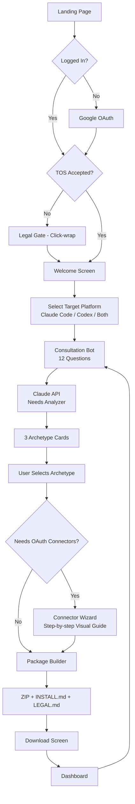
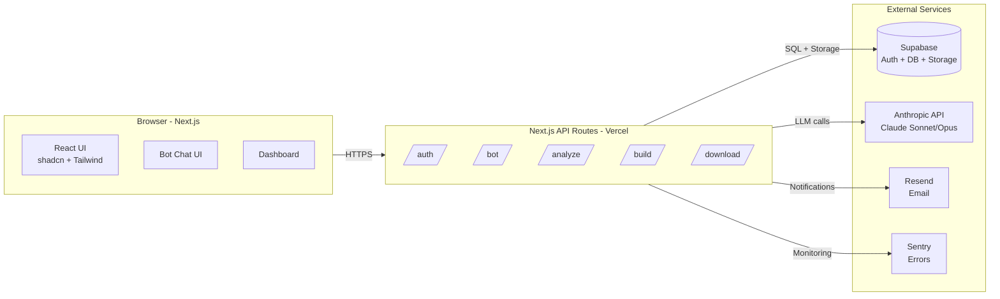
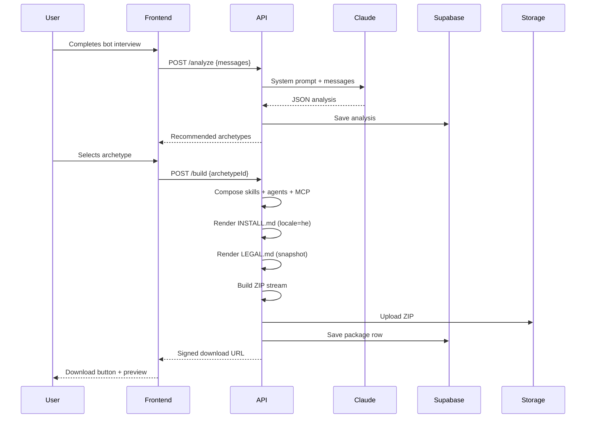
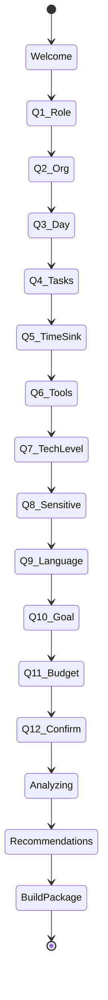

# GenerAgent — דיאגרמה ארכיטקטונית

## זרימת המשתמש (User Journey)



## ארכיטקטורת המערכת (System Architecture)



## תהליך יצירת החבילה (Package Build Pipeline)



## מבנה חבילת הסוכן (Package Structure)

```
my-agent-package.zip
│
├── README.md                  ← הסבר כללי בעברית
├── INSTALL.md                 ← מדריך התקנה צעד-אחר-צעד
├── LEGAL.md                   ← הסכם חתום + hash
│
├── .claude/                   ← עבור Claude Code
│   ├── settings.json
│   ├── agents/
│   │   └── personal-assistant.md
│   └── skills/
│       ├── email-triage/
│       │   └── SKILL.md
│       └── calendar-summary/
│           └── SKILL.md
│
├── codex/                     ← עבור Codex CLI
│   ├── AGENTS.md
│   └── codex.config.toml
│
├── mcp/                       ← MCP Connectors
│   ├── mcp.json
│   └── README.md (OAuth instructions)
│
└── scripts/
    ├── install.sh             ← Mac/Linux installer
    └── install.ps1            ← Windows installer
```

## State Machine של הבוט


